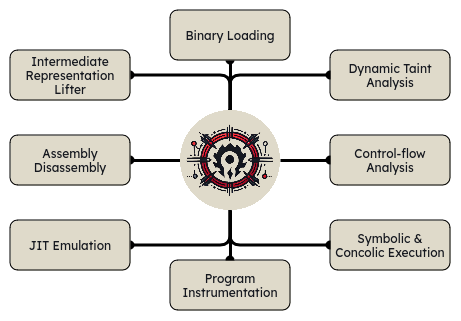

    
    &nbsp;
    <h1>Horde</h1>
    

        Horde is a suite of binary analysis tools for reverse engineering made in Rust with Python bindings. It aims to ease the analysis, modifying and generation of binary programs with various techniques.
    

    

        
    

## 📦 Features

  

### 🎯 Roadmap

**v0.1.0 - Binary Loader**

- [ ] Load Binaries (ELF, PE, Mach-O)

**v0.2.0 - IL Lifter**

- [ ] x86, x64, ARM, MIPS, RISC-V Expression-Based Intermediate Language (IL)

**v0.3.0 - Assembly/Disassembly**

- [ ] Assembling and Disassembling for Supported Architectures

**v0.4.0 - Emulation and JIT**

- [ ] Emulation for Supported Architectures
- [ ] Just-In-Time (JIT) Compilation

**v0.5.0 - Advanced Program Analysis and Instrumentation**

- [ ] Program Instrumentation (Intel Pin Tools)
- [ ] Hooking

**v0.6.0 - Dynamic Taint Analysis**

- [ ] Analyze tainted data and its propagation in the program

**v0.7.0 - Control-flow Analysis**

- [ ] Build and analyze control-flow graphs (CFGs)

**v0.8.0 - Symbolic and Concolic Execution**

- [ ] Symbolic and Concolic Execution for Path Exploration

## 🧩 Usage

To-do

## 📚 Documentation

To-do

**v?**
- [ ] Program instrumentation
- [ ] Wrap Intel Pin tools
- [ ] Dynamic taint analysis
- [ ] Control-flow analysis
- [ ] Symbolic and concolic execution
